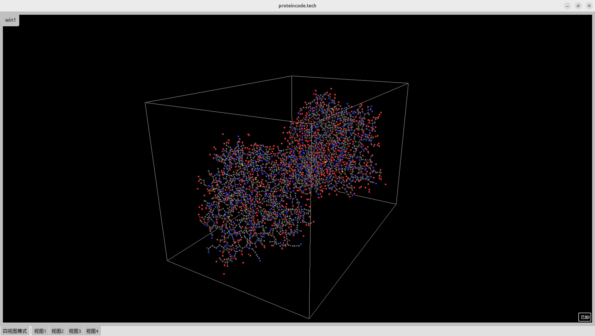

# Protein Code Shell （Ver. 0.01）


A professional protein structure visualization tool with multiple viewports, built with Python, VisPy and PySide6.

## Features

- **Multi-view visualization**: Simultaneously display protein structures in 4 different views
- **Interactive 3D rendering**: Rotate, zoom and pan the protein structure in real-time
- **Multiple display modes**: Toggle between quad-view and single-view modes
- **PDB file support**: Load and visualize standard Protein Data Bank (PDB) files
- **CPK coloring**: Atoms are colored according to the Corey-Pauling-Koltun (CPK) convention
- **Automatic bond detection**: Detects covalent bonds either from CONECT records or by distance

## Screenshots


*Quad-view mode showing protein from different angles*


*Single view mode with detailed visualization*

## Installation

1. Clone this repository:
   ```bash
   git clone https://github.com/yourusername/protein-visualizer.git
   cd protein-visualizer
2. Install the required dependencies:
    - **Python 3.8+**
    - PySide6
    - VisPy
    - Biopython
    - NumPy
3. Run the application:
    ```BASH
    python main.py
4. Usage:
    - **Left-click + drag:** Rotate the view
    - **Right-click + drag:** Pan the view
    - **Scroll wheel:** Zoom in/out
    - **Toolbar buttons:** Switch between view modes

5. Code Structure
    ```bash
    protein-visualizer/
    ├── elements.py            # 3D visualization elements (e.g., wireframe cube)
    ├── multi_view_window.py   # Main window with multiple viewports
    ├── protein_draw.py        # PDB file parsing and bond detection
    ├── protein_visualizer.py  # Core visualization logic
    ├── main.py                # Application entry point
    └── README.md              # This file

## Development
- Contributions are welcome! Please open an issue or submit a pull request. 
 - For any questions or suggestions, feel free to contact us at: contact@proteincode.tech

## License
This project is licensed under the MIT License - see the LICENSE file for details.

## Acknowledgments
- VisPy for high-performance scientific visualization
- PySide6 for the Qt interface
- Biopython for PDB file parsing


